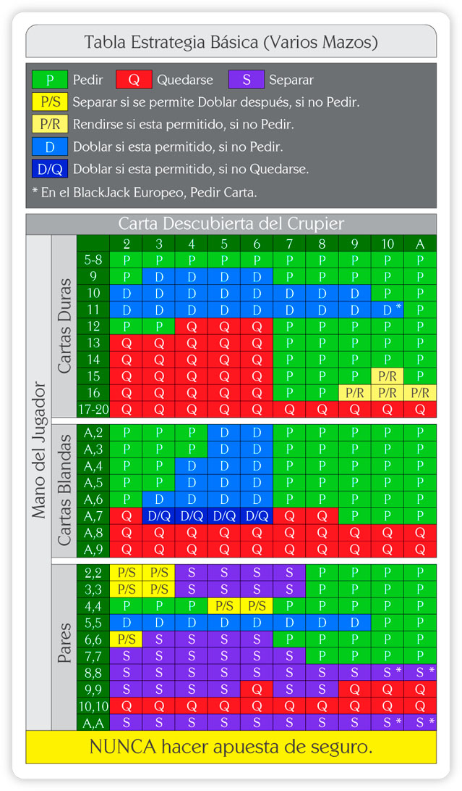

# Blackjack

Blackjack simulator to test if table works to double the initial money

### Established rules:

#### Dealer

The dealer will start with 5 decks of poker, fully shuffled. When the remaining cards are below half the initial number of cards, put all the cards back in the deck and reshuffle.

The game starts when the dealer takes 2 cards and also serve the player 2 cards. But only the first card of the dealer will be visible to the player.

When the dealer has served every player and the player did his decisions, the dealers face-down card is turned up. If the total is 17 or more, it must stand. If the total is 16 or under, they must take a card. The dealer must continue to take cards until the total is 17 or more, at which point the dealer must stand. If the dealer has an ace, and counting it as 11 would bring the total to 17 or more (but not over 21), the dealer must count the ace as 11 and stand

#### Player

The player will make the necessary decision on each hand by always following the blackjack table, which promises the best chance of winning in the game. These possible decisions are ([Source](https://www.blackjackapprenticeship.com/how-to-play-blackjack/)): 

- **Stand** – If your first two cards are acceptable, you can stand and the dealer will move on to the next player.
- **Hit** – If you would like more cards to improve your hand total, the dealer will deal you more cards, one at a time, until you either “bust” (go over 21) or you choose to stand. There is no limit on the number of cards you can take (other than going over a total of 21). 
- **Double Down –** If you have a hand total that is advantageous to you but you need to take an additional card you can double your initial wager and the dealer will deal you only 1 additional card.
- **Split** – If you’re dealt a pair (2 cards of equal value) you have the option to put out a second wager and the dealer will split the two cards so that each card will become the first card on two new hands.

### Hypothesis

The blackjack table holds the key to winning most games, so the player will have the best chance of being victorious if he follows it.

### Scientific evidence

The experiment will consist of playing 100 games. In each game the player will start with €100. If he/she manages to double the money he/she entered with (€200) we will consider it a win and the player will leave the table. If the player's bankroll reaches €0, it will be considered a loss, and the player will also leave the table. By repeating this for 100 games, we can see empirically how many times the player wins, and how many times the "casino" wins.

The player will follow one of the best known techniques in the game, he will bet only €1 the first time, if he wins, he will continue with that bet, if he loses, he will double it until he recovers what he has lost, and at the same time wins what he would have had to win previously.
